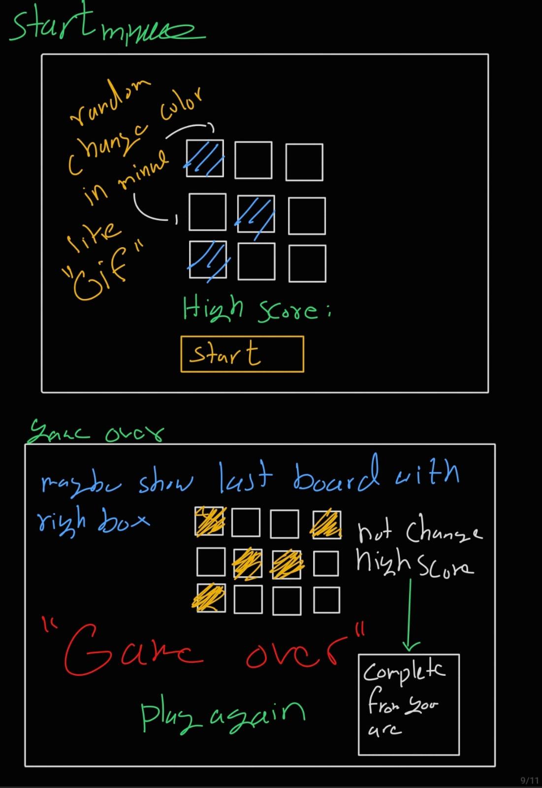
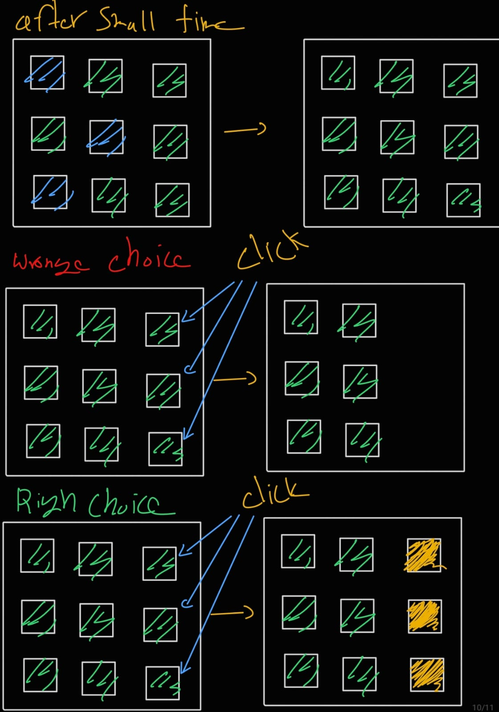

# Visual Memory Test
## Date 30-6-2025

### By: Jawad Hassan
[Linkedin](#) | [Github](#) 

### Visual Memory: is a memory game. You have a dimension (n*n), and a random square appears for a short time. You must remember all positions of these boxes. But be aware—every level gives you a limited number of tries. If you fail, you lose one core. After you finish all your cores, you lose. But you can try again. Good luck!

## Technology used
1. Program languages
  * JavaScript
  * HTML && CSS

## Getting Strated

### Logic and Function

1. #### start dimension (3 * 3), then add sequence like after 2 levels dimension becomes (4 * 4) and so on
2. #### automatically create box with click listener and class and id, id must equal to the index for easy manage
3. #### add core life and secondary life, if go to the next level secondary life resets, but if you lose core, level decreases by one
4. #### add array to track [all board, true guess, false guess], and other stats
5. #### random box gets different color for some time then returns to the default color
6. #### number of boxes increases when level up
7. #### compare the effected boxes with user guess, if equal then pass to the next level

### Game Start && plan

1. #### save everything in variables as much as possible, if I need it keep it, else just remove it
2. #### read as string for easy tracking and editing
3. #### add div control dashboard when coding, div calls function for easy tracking like print all boards
4. #### dynamic way by using variables, change only one variable to change the game like lives, number of 5. squares, level speed, or showing time
6. #### there is an initialize function that calls others
7. #### function for creating boxes, decide number of dimensions, size of box, color, create box with listener, class, and id equal to the index
8. #### function to generate random effected board and change color for some time
9. #### handleClick function when user click on box
10. #### function compares the clicked box with effected board, also updates stats like level, core lives, and secondary lives
11. #### function to go to the next level when user clicks all correct boxes
12. #### function resets boards and keeps same dimension when user loses but still has more core lives
13. #### function stops game when core lives finish
14. #### functon stop game when core live finsin
15. #### gameover menu, start menu, all nice and light color to make player happy

##
## Game Start

##
## Some Functionality 

